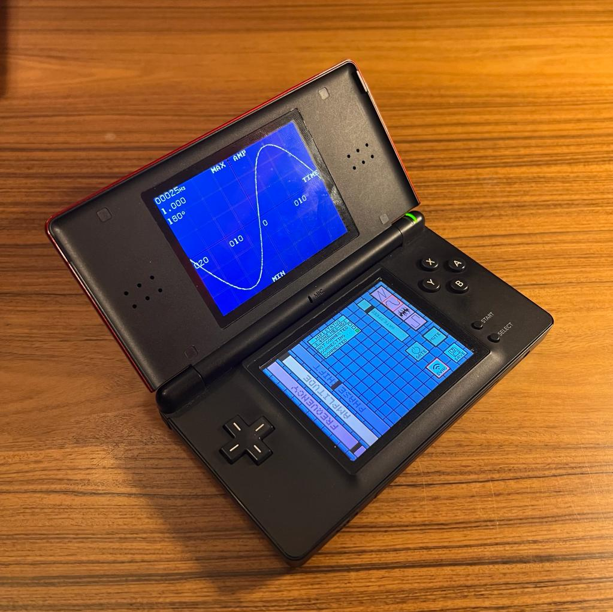

# NDSerum
NDSerum is a frequency generator for the Nintendo DS that supports multiple wave forms (sin wave, saw wave, square wave, white noise) and a frequency range of 20 to 20'000hz (audible spectrum). 

## Application
Here is a picture of the main screen of the application:

## Usage
Here is a list of the key bindings usable in the app:

1. KEY_RIGHT / KEY_LEFT = Change the wave type
2. KEY_UP / KEY_DOWN = Change the number of wave periods displayed
3. KEY_L / KEY_R = Change the phase of the wave (fine tuning)
4. KEY_A = Mute/Unmute the sound
5. KEY_X / KEY_B = Increment/Decrement the wave frequency (fine tuning)
6. KEY_START = Enable/Disable the wireless sound synchronization
7. KEY_Y = Enable/Disable gate effect
8. Touchscreen
* Control of the wave parameters with the sliders/buttons (alternative to the
keypad controls)
* Control of the sound gate effect (on/off, gate speed)
* Control of the wifi sync functionality
* Control of the default parameters saving

## Contributors
- Cassien Roth Beneton ([@Kassflute](https://github.com/KassFlute))
- Quentin Sandoz ([@TheTexanCodeur](https://github.com/TheTexanCodeur))
